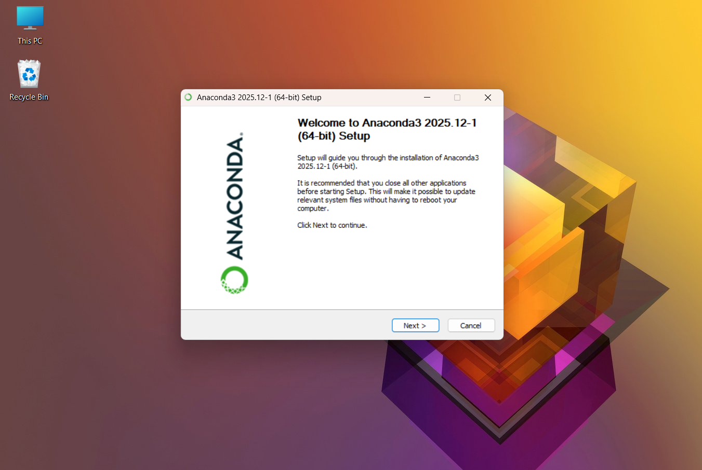
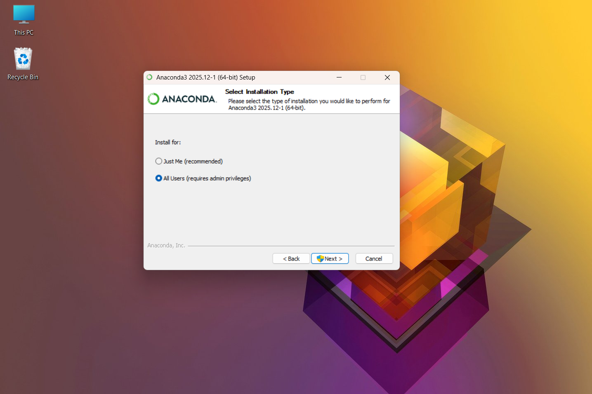
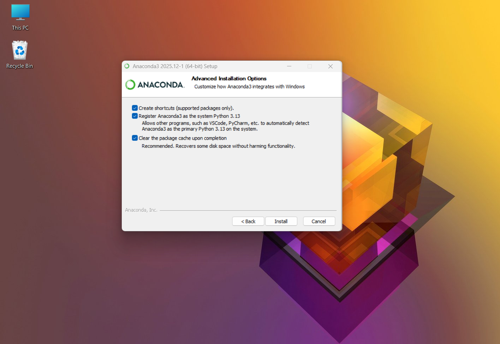
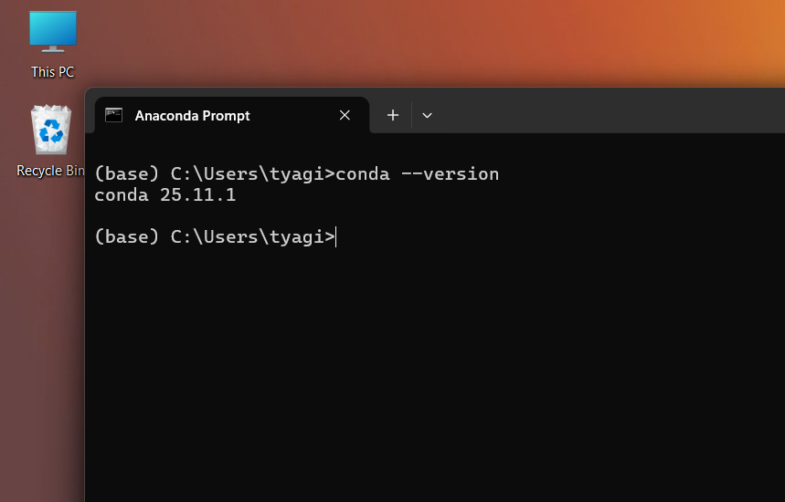

# 🐍🚀 How to Install Anaconda 2025 (Step-by-Step) 💻📦

**Anaconda** 🐍📦 is a **powerful Python & Data Science distribution** that comes with:

> 🐍 Python + 📊 Data Science libraries + 🤖 ML tools + 📓 Jupyter + 🧠 Conda

—all bundled together in **one easy installer** 🎁✨

It is **highly recommended** for:

* Data Science 📊
* AI / Machine Learning 🤖
* Deep Learning 🧠
* Python development 🐍💻


## 🧠 Why use Anaconda? 🤔✨

With Anaconda, you get:

* ✅ Python pre-installed 🐍
* ✅ 1000+ data science libraries 📚
* ✅ Conda package manager 📦
* ✅ Virtual environments 🌍
* ✅ Jupyter Notebook & JupyterLab 📓🚀

💡 No need to install everything manually!


## 🌍 Step 1️⃣: Download Anaconda 2025

1. Open your browser 🌐
2. Go to the **official Anaconda website** 🔗
   👉 [https://www.anaconda.com](https://www.anaconda.com)

📸 Screenshot Example:


3. Click on **Download** ⬇️
4. Choose your **Operating System** 💻:

   * 🪟 Windows
   * 🍎 macOS
   * 🐧 Linux
5. Download **Anaconda 2025 (Python 3.x)** 🐍✨

📸 Screenshot Example:


## 🪟 Step 2️⃣: Install Anaconda on Windows (2025)

1. Double-click the downloaded `.exe` file 🖱️
2. Click **Next** ➡️
3. Agree to the **License Agreement** 📜✅
4. Choose:

   * **Just Me (Recommended)** 👤👍
5. Select installation location 📁
   *(Default is recommended)* ⭐
6. ⚠️ **Important Options**:

   * ❌ Do NOT check “Add Anaconda to PATH”
   * ✅ Register Anaconda as default Python 🐍
7. Click **Install** 🚀

⏳ Installation may take a few minutes…

📸 Screenshot Example:




## 🚀 Step 3️⃣: Verify Anaconda Installation

Open **Anaconda Navigator** 🧭✨

OR open **Terminal / Anaconda Prompt / Command Prompt** 💻 and run:

```bash
conda --version
```

If installed correctly, you’ll see:

✅ `conda 25.x.x` (or similar)

📸 Screenshot Example:


🎉 Congrats! Anaconda is installed successfully!


## 🧠 When should YOU use Anaconda? 🤖📊

Use **Anaconda** if you:

* Are learning **Python 🐍**
* Work in **Data Science 📊**
* Build **AI / ML models 🤖**
* Want hassle-free package management 📦
* Need professional tools 🚀


## 🧾✨ In simple words

👉 **Anaconda 2025 is the easiest and most powerful way to set up Python for Data Science, AI, and Machine Learning — all in one installation.** 🐍🤖📊🔥


